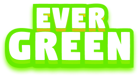

  

## Projet 2CP - Jeu mobile pour la protection de l'environnement -

"EVERGREEN", le jeu mobile engagé pour la protection de l'environnement.

## Utilisé par

Ce jeu est utilisé par :
- Un public varié, y compris les enfants âgés de 7 ans et plus qui ont déjà acquis la capacité de lire. Offrant une expérience éducative divertissante, il encourage les jeunes à s'immerger dans un monde virtuel tout en apprenant les valeurs de la durabilité et de la préservation de notre planète.

## Auteurs

* [CHERGUELAINE Oussama](https://github.com/ousscher)
* [MAHRAZ Abderahman]
* [BELHARDA Aya]
* [KADRI Lyna]
* [TOUTOU Salsabila]
* [CHERRAF Nourelhouda]

## Charte graphique

| Couleur             | Code Hexadécimal                                                                |
| ----------------- | ------------------------------------------------------------------ |
| bleu clair |  #4CDAFE |
| beige foncé |  #FFD217 |
| vert |  #67EB00 |
| move clair |  #DD67ED |

## Guide d'utilisation

* [Notice d’utilisation PDF](https://drive.google.com/file/d/1eJQVIbXojgwJAjK8qin-A1Yq0Aaun63N/view?usp=sharing)

## Guide d’installation

* [Notice d’installation PDF](https://drive.google.com/file/d/1Ip1xgkHyk78BL5WucTI9bh4KQ6w3NnVH/view?usp=sharing)

## Remerciement

* Nous souhaitons exprimer nos sincères remerciements à Mr Balla A. et Mme Bourai S. pour leur encadrement précieux tout au long de ce projet. Leur expertise, leurs conseils et leur soutien nous ont permis de mener à bien notre travail.
* Un grand merci à vous, utilisateurs de notre projet, pour votre confiance et l'utilisation de notre produit au service de votre association caritative.
